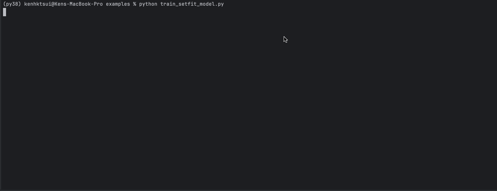

# ∞🧙🏼‍♂️AnyClassifier - One Line To Build Zero-Data Classifiers in Minutes, And A Step Towards The First AI ML Engineer


>Have you ever wanted/ been requested to build a classifier without any data? What it takes now is just one line 🤯.   

**AnyClassifier** is a framework that empowers you to create high-performance classifiers without any labels or data, using minimal code. 
It's designed to revolutionize the machine learning development process by eliminating the need for extensive data curation and labeling.

## 🚀 Key Features
- **Zero Data Required**: Build classifiers from scratch, even without a dataset
- **Competitive Result**: Achieving competitive results with synthetic data, comparable to using real data 🚀 - See [Benchmark](#benchmark)
- **Multilingual Synthetic Data Generation**: Supports generating whatever language as long as your LLM model can. 
- **One-Line Implementation**: Democratizing AI for everyone, and agent (as a plugin for agentic flow)
- **LLM-Powered Synthetic Data and Annotations**: Leverage SOTA LLM for high-quality synthetic data generation and labeling -  See [approach](docs/synthetic_data_generation.md)
- **Designed for Real-World Use**: Created by ML engineers, for ML and software engineers

## 🎯 Why AnyClassifier?
As machine learning engineers, we understand the challenges of building and curating high-quality labeled datasets.  
The challenge amplifies when you want to build a multilingual dataset.  
AnyClassifier eliminates this bottleneck, allowing you to focus on what matters most - solving real-world problems.

## 🏁 QuickStart in Apple Silicon - Train a model in 5 min!
<details>
<summary>Expand</summary>

```shell
# install (cp39 = python3.9, other valid values are cp310, cp311, cp312)
curl -L -O https://github.com/abetlen/llama-cpp-python/releases/download/v0.2.88-metal/llama_cpp_python-0.2.88-cp39-cp39-macosx_11_0_arm64.whl
pip install llama_cpp_python-0.2.88-cp39-cp39-macosx_11_0_arm64.whl
rm llama_cpp_python-0.2.88-cp39-cp39-macosx_11_0_arm64.whl
pip install anyclassifier
# run
cd examples
python train_setfit_model_imdb.py
```
</details>


## 🏁 QuickStart in Colab

| Dataset                       | Colab Link                                                                                                                                                          |
|-------------------------------|---------------------------------------------------------------------------------------------------------------------------------------------------------------------|
| No Data!                      | [](https://colab.research.google.com/drive/1Wt_IlilfTqBbyn3gZQ3kITjObrVAypyi?usp=sharing) |
| imdb sentiment classification | [](https://colab.research.google.com/drive/1LB8PUTT9wM1Qb2cY-6Dx-RNiqmyCvRr1?usp=sharing) |


## 🛠️ Usage
### Download a small LLM (please accept the respective terms and condition of model license beforehand)
[meta-llama/Meta-Llama-3.1-8B-Instruct](https://huggingface.co/meta-llama/Meta-Llama-3.1-8B-Instruct)  
[google/gemma-2-9b](https://huggingface.co/google/gemma-2-9b)
```python
from huggingface_hub import hf_hub_download

# meta-llama/Meta-Llama-3.1-8B-Instruct
hf_hub_download("lmstudio-community/Meta-Llama-3.1-8B-Instruct-GGUF", "Meta-Llama-3.1-8B-Instruct-Q8_0.gguf")

# google/gemma-2-9b
hf_hub_download("lmstudio-community/gemma-2-9b-it-GGUF", "gemma-2-9b-it-Q8_0.gguf")
```

### One Liner For No Data

```python
from huggingface_hub import hf_hub_download
from anyclassifier import build_anyclassifier
from anyclassifier.schema import Label

# Magic One Line!
trainer = build_anyclassifier(
  "Classify a text's sentiment.",
  [
    Label(id=1, desc='positive sentiment'),
    Label(id=0, desc='negative sentiment')
  ],
  hf_hub_download("lmstudio-community/Meta-Llama-3.1-8B-Instruct-GGUF", "Meta-Llama-3.1-8B-Instruct-Q8_0.gguf")
)
# Share Your Model!
trainer.push_to_hub("user_id/any_model")
```

### One Liner For Unlabeled Data
```python
from huggingface_hub import hf_hub_download
from anyclassifier import build_anyclassifier
from anyclassifier.schema import Label

unlabeled_dataset  # a huggingface datasets.Dataset class can be from your local json/ csv, or from huggingface hub.

# Magic One Line!
trainer = build_anyclassifier(
  "Classify a text's sentiment.",
  [
    Label(id=1, desc='positive sentiment'),
    Label(id=0, desc='negative sentiment')
  ],
  hf_hub_download("lmstudio-community/Meta-Llama-3.1-8B-Instruct-GGUF", "Meta-Llama-3.1-8B-Instruct-Q8_0.gguf"),  # as you like
  unlabeled_dataset
)
# Share Your Model!
trainer.push_to_hub("user_id/any_model")
```

### To Use Model

```python
# SetFit
from setfit import SetFitModel

model = SetFitModel.from_pretrained("user_id/any_model")
preds = model.predict(["i loved the spiderman movie!", "pineapple on pizza is the worst 🤮"])
print(preds)

# FastText
from anyclassifier.fasttext_wrapper import FastTextForSequenceClassification

model = FastTextForSequenceClassification.from_pretrained("user_id/any_model")
preds = model.predict(["i loved the spiderman movie!", "pineapple on pizza is the worst 🤮"])
print(preds)
```

## 🔧 Installation
It is using llama.cpp as backend, and build wheel can take a lot of time (10min+), as such, we also provide an instruction to install with pre-built wheel.
<details>
<summary>Metal Backend (Apple's GPU) - cp39 = python3.9, other valid values are cp310, cp311, cp312</summary>

```shell
curl -L -O https://github.com/abetlen/llama-cpp-python/releases/download/v0.2.88-metal/llama_cpp_python-0.2.88-cp39-cp39-macosx_11_0_arm64.whl
pip install llama_cpp_python-0.2.88-cp39-cp39-macosx_11_0_arm64.whl
rm llama_cpp_python-0.2.88-cp39-cp39-macosx_11_0_arm64.whl
pip install anyclassifier
```
</details>

<details>
<summary>Colab (T4) Prebuilt Wheel</summary>

```shell
curl -L -O https://github.com/abetlen/llama-cpp-python/releases/download/v0.2.88-cu124/llama_cpp_python-0.2.88-cp310-cp310-linux_x86_64.whl
pip install llama_cpp_python-0.2.88-cp310-cp310-linux_x86_64.whl
rm llama_cpp_python-0.2.88-cp310-cp310-linux_x86_64.whl
pip install anyclassifier
```
</details>

<details>
<summary>CUDA Backend (Please read [llama-cpp-python](https://llama-cpp-python.readthedocs.io/en/latest/#installation))</summary>

```shell
CMAKE_ARGS="-DGGML_METAL=on" pip install anyclassifier
```
</details>

<details>
<summary>CPU</summary>

```shell
CMAKE_ARGS="-DGGML_BLAS=ON -DGGML_BLAS_VENDOR=OpenBLAS" pip install anyclassifier
```
</details>

<details>
<summary>Developer's installation</summary>

```shell
pip install -e .
```
</details>

## Other Usages
### To Label a Dataset

```python
from datasets import load_dataset
from anyclassifier.annotation.prompt import AnnotationPrompt
from anyclassifier.schema import Label
from anyclassifier.annotation.annotator import LlamaCppAnnotator

unlabeled_dataset = load_dataset("somepath")
prompt = AnnotationPrompt(
  task_description="Classify a text's sentiment.",
  label_definition=[
      Label(id=0, desc='negative sentiment'),
      Label(id=1, desc='positive sentiment')
  ]  
)
annotator = LlamaCppAnnotator(prompt)
label_dataset = annotator.annotate_dataset(unlabeled_dataset, n_record=1000)
label_dataset.push_to_hub('user_id/any_data')
```

### To Generate a Synthetic Dataset
```python
from anyclassifier.schema import Label
from anyclassifier.synthetic_data_generation import SyntheticDataGeneratorForSequenceClassification

tree_constructor = SyntheticDataGeneratorForSequenceClassification()
dataset = tree_constructor.generate(
    "Classify a text's sentiment.",
    [
        Label(id=0, desc='negative sentiment'),
        Label(id=1, desc='positive sentiment')
    ]
)
dataset.push_to_hub('user_id/any_data')
```

See more examples in [examples](./examples)  

| dataset                                          | approach                  | model_type | example                                                          | resulting model                                                       | dataset  |
|--------------------------------------------------|---------------------------|------------|------------------------------------------------------------------|-----------------------------------------------------------------------|--------------|
| "stanfordnlp/imdb" like                          | synthetic data generation | setfit     | [link](examples/train_setfit_model_imdb_synthetic.py)            | [link](https://huggingface.co/kenhktsui/setfit_test_imdb)             | [link](https://huggingface.co/datasets/kenhktsui/test_imdb_syn) |
| stanfordnlp/imdb                                 |  annotation               | setfit     | [link](examples/train_setfit_model_imdb.py)                      | [link](https://huggingface.co/kenhktsui/anyclassifier_setfit_demo)    | [link](https://huggingface.co/datasets/kenhktsui/test_imdb) |
| "zeroshot/twitter-financial-news-sentiment" like | synthetic data generation | setfit     | [link](examples/train_setfit_model_twitter_financial_news_sentiment_synthetic.py) | [link](https://huggingface.co/kenhktsui/setfit_test_twitter_news_syn) | [link](https://huggingface.co/datasets/kenhktsui/test_twitter_financial_news_syn) |
| zeroshot/twitter-financial-news-sentiment        |  annotation               | setfit     | [link](examples/train_setfit_model_twitter_financial_news_sentiment.py) | [link](https://huggingface.co/kenhktsui/setfit_test_twitter_news)     | [link](https://huggingface.co/datasets/kenhktsui/test_twitter_financial_news) |
| "ccdv/arxiv-classification" like                 | synthetic data generation | setfit     | [link](examples/train_setfit_model_arxiv_topic_synthetic.py)     | [link](kenhktsui/setfit_test_arxiv_classification_syn)                | [link](https://huggingface.co/datasets/kenhktsui/test_arxiv_classification_syn) |
| ccdv/arxiv-classification                        |  annotation               | setfit     | [link](examples/train_setfit_model_arxiv_topic.py)               | [link](kenhktsui/setfit_test_arxiv_classification)                    | [link](https://huggingface.co/datasets/kenhktsui/test_arxiv_classification_syn) |
| "lmsys/toxic-chat, toxicchat0124" like           | synthetic data generation | setfit     | [link](examples/train_setfit_model_toxic_chat_synthetic.py)      | [link](kenhktsui/setfit_test_toxic_chat_syn)                          | [link](https://huggingface.co/datasets/kenhktsui/test_toxic_chat_syn) |
| lmsys/toxic-chat, toxicchat0124                  |  annotation               | setfit     | [link](examples/train_setfit_model_toxic_chat.py)                | [link](kenhktsui/setfit_test_toxic_chat)                              | [link](https://huggingface.co/datasets/kenhktsui/test_toxic_chat) |
| "fancyzhx/ag_news" like                          | synthetic data generation | setfit     | [link](examples/train_setfit_model_ag_news_synthetic.py)         | [link](https://huggingface.co/kenhktsui/setfit_test_ag_news_syn)      | [link](https://huggingface.co/datasets/kenhktsui/test_ag_news_syn) |
| fancyzhx/ag_news                                 |  annotation               | setfit     | [link](examples/train_setfit_model_ag_news.py)                   | [link](https://huggingface.co/kenhktsui/setfit_test_ag_news)          | [link](https://huggingface.co/datasets/kenhktsui/test_ag_news) |
| chinese sentiment                                | synthetic data generation | N/A        | [link](examples/generate_synthetic_chinese.py)                                                         | -                                                                     | [link](https://huggingface.co/datasets/kenhktsui/chinese_sentiment_syn) |


## 🧪Benchmark
The objective is to see if synthetic data is performing as well as real data (annotation). Full training dataset indicates the upper limit of performance as more data is available. 
Model performance of synthetic data is at par with/ close to that of real data, which is not bad because the testing data is usually by design more similar to training (real) data than synthetic data.
We also note that synthetic data is also advantageous when class is highly imbalanced like the toxic chat problem.  
Our benchmark implies the synthetic data generated is close to the distribution of test data, showing the effectiveness of this synthetic data generation approach, without using any real data.  
All models finetune on `sentence-transformers/paraphrase-mpnet-base-v2` (109M). The performance can be boosted by using a larger base model and generating more data.

| dataset  | metric             | synthetic data generation | annotation | full training dataset | full training reference|
|--|--------------------|---------------------------|------------|-----------------------|--|
|stanfordnlp/imdb| accuracy           | 0.878                     | 0.908      | 0.928                 |[lvwerra/distilbert-imdb](https://huggingface.co/lvwerra/distilbert-imdb)  |
|zeroshot/twitter-financial-news-sentiment| f1 (weighted)      | 0.631                     | 0.676      | 0.866                 |[nickmuchi/finbert-tone-finetuned-fintwitter-classification](https://huggingface.co/nickmuchi/finbert-tone-finetuned-fintwitter-classification) |
|ccdv/arxiv-classification| acurracy           | 0.618                     | 0.566      | 0.805                 | [paper](https://ieeexplore.ieee.org/stamp/stamp.jsp?tp=&arnumber=8675939)                           |
|lmsys/toxic-chat, toxicchat0124 | f1 (binary) | 0.362                     | 0.00*      | 0.822                 | [lmsys/toxicchat-t5-large-v1.0](https://huggingface.co/lmsys/toxicchat-t5-large-v1.0)               |
|fancyzhx/ag_news| accuracy           | 0.768                     | 0.765      | 0.938                 | [fabriceyhc/bert-base-uncased-ag_news](https://huggingface.co/fabriceyhc/bert-base-uncased-ag_news) |

\* Out of 42 annotations, only 2 labels is positive, making learning hard.

Codes to replicate is stored in [examples](examples/benchmark.py).
We will continue to add more benchmark on other datasets.


## 📜 Documentation
See [docs](./docs) on our detailed methodology and documentation.

## 🗺️ Roadmap
- High Quality Data:
  - Prompt validation
  - Label validation - inter-model annotation
  - R&D in synthetic data generation
- High Quality Model
  - Auto error analysis
  - Auto model documentation
  - Auto targeted synthetic data
- More Benchmarking
- Multilingual Support

# 👋 Contributing
- build models with AnyClassifier
- suggest features
- create issue/ PR
- benchmarking synthetic data generation vs annotation vs full training dataset

# 📄 License
AnyClassifier is released under the MIT License.

# 🤝🏻 Credits
Without these open source models and libraries, this project would not have been possible. 
- powerful open source and consumer friendly LLMs e.g. Llama 3.1 8B and Gemma 2 9B
- [llama.cpp](https://github.com/ggerganov/llama.cpp) and [llama-cpp-python](https://github.com/abetlen/llama-cpp-python)
- [setfit](https://github.com/huggingface/setfit)
- huggingface ecosystem

# 📖 Citation
If you like this work, please cite:
```
@software{Tsui_AnyClassifier_2024,
author = {Tsui, Ken},
month = {8},
title = {{AnyClassifier}},
url = {https://github.com/kenhktsui/anyclassifier},
year = {2024}
}
```

# 📩 Follow Me For Update:
[X](https://x.com/kenhktsui)/ [huggingface](https://huggingface.co/kenhktsui)/ [github](https://github.com/kenhktsui)
