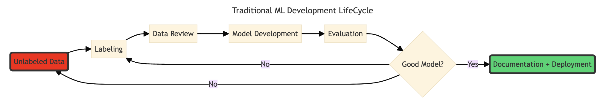
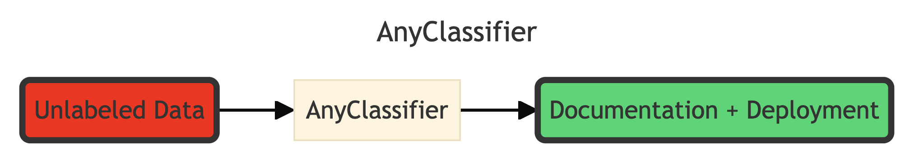

# ∞🧙🏼‍♂️AnyClassifier - One Line To Build Any Classifier Without Data, And A Step Towards The First ML Engineer




>Have you ever wanted/ been requested to build a classifier without any labeled data? What it takes now is just one line 🤯.   

**AnyClassifier** is a framework that helps you build a classifier **without** any label, with as limited coding as possible.    
As a machine learning engineer, one of the unavoidable but the most heavy lifting issues is to build and curate a high quality labelled data.   
By leveraging LLM 🤖 annotation with permissive license, one can now label data at a better quality and at lightning speed ever.    
This is inspired by some of the challenges I faced daily in work and doing open source - it is built for **machine learning engineer and software engineer**, by **machine learning engineer** 👨🏻‍💻.    
By providing a higher level abstraction, this project's mission is to further **democratizes** AI to everyone, with **ONE LINE**.   
The project is still experimental, but I found it worked in some of my use cases. Feedbacks welcome, and feel free to contribute. See [Future Roadmap](#future-roadmap).  
Together let's build more useful models.

## 🚀 Features
- One line to build any classifier that you don't have data 🤯
- Why one line? Not only it is easy to be used by Human but also it can easily be used by other LLM as a function call, easily to be integrated with any **agentic flow**
- Smoothness integration with transformers, setfit, fasttext and datasets
  - [setfit](https://github.com/huggingface/setfit): for limited data (e.g. 100) 🤗
  - [fastText](https://github.com/facebookresearch/fastText): for blazingly fast inference (1000 docs/s) without GPU ⚡️
  - [transformers](https://github.com/huggingface/transformers): for other usecase
- Huggingface-like interface for fastText that supports push_to_hub, saving and loading (let's not forget this amazing model before transformers architecture).

## 🏁 QuickStart in Colab
| Dataset                       | Colab Link                                                                                                                                                          |
|-------------------------------|---------------------------------------------------------------------------------------------------------------------------------------------------------------------|
| imdb sentiment classification | [](https://colab.research.google.com/drive/1LB8PUTT9wM1Qb2cY-6Dx-RNiqmyCvRr1?usp=sharing) |


## 🔧 Installation
It is using llama.cpp as backend, and build wheel can take a lot of time (10min+), as such, we also provide an instruction to install with pre-built wheel.
### Colab (T4) Prebuilt Wheel
```shell
wget https://github.com/abetlen/llama-cpp-python/releases/download/v0.2.84-cu124/llama_cpp_python-0.2.84-cp310-cp310-linux_x86_64.whl
pip install llama_cpp_python-0.2.84-cp310-cp310-linux_x86_64.whl
rm llama_cpp_python-0.2.84-cp310-cp310-linux_x86_64.whl
pip install anyclassifier
```
 
### Metal Backend (Apple's GPU - so you don't have to deal with CUDA compatibility issue)
```shell
CMAKE_ARGS="-DGGML_CUDA=on" pip install anyclassifier
```

### CUDA Backend (Please read [llama-cpp-python](https://llama-cpp-python.readthedocs.io/en/latest/#installation))
```shell
CMAKE_ARGS="-DGGML_METAL=on" pip install anyclassifier
```

### CPU
```shell
CMAKE_ARGS="-DGGML_BLAS=ON -DGGML_BLAS_VENDOR=OpenBLAS" pip install anyclassifier
```

### Developer's installation
```shell
pip install -e .
```

## 🛠️ Usage
### Download a small LLM (please accept the respective terms and condition of model license beforehand)
[meta-llama/Meta-Llama-3.1-8B-Instruct](https://huggingface.co/meta-llama/Meta-Llama-3.1-8B-Instruct)  
[google/gemma-2-9b](https://huggingface.co/google/gemma-2-9b)
```python
from huggingface_hub import hf_hub_download

# meta-llama/Meta-Llama-3.1-8B-Instruct
hf_hub_download("lmstudio-community/Meta-Llama-3.1-8B-Instruct-GGUF", "Meta-Llama-3.1-8B-Instruct-Q8_0.gguf")

# google/gemma-2-9b
hf_hub_download("lmstudio-community/gemma-2-9b-it-GGUF", "gemma-2-9b-it-Q8_0.gguf")
```

### One Liner
```python
from huggingface_hub import hf_hub_download
from anyclassifier import build_anyclassifier
from anyclassifier.annotation.prompt import Label

unlabeled_dataset  # a huggingface datasets.Dataset class can be from your local json/ csv, or from huggingface hub.

# Magic One Line!
trainer = build_anyclassifier(
  "Classify a text's sentiment.",
  [
    Label(name='1', desc='positive sentiment'),
    Label(name='0', desc='negative sentiment')
  ],
  hf_hub_download("lmstudio-community/Meta-Llama-3.1-8B-Instruct-GGUF", "Meta-Llama-3.1-8B-Instruct-Q8_0.gguf"),  # as you like
  unlabeled_dataset,
  column_mapping={"text": "text"},
  model_type="setfit",  # can be set to fastText
  push_dataset_to_hub=True,  # we recommend to push your dataset to huggingface, so that you won't lose it
  dataset_repo_id="user_id/test",
  is_dataset_private=True
)
# Share Your Model!
trainer.push_to_hub("user_id/any_model")
```

### To Use Model

```python
# SetFit
from setfit import SetFitModel

model = SetFitModel.from_pretrained("user_id/any_model")
preds = model.predict(["i loved the spiderman movie!", "pineapple on pizza is the worst 🤮"])
print(preds)

# FastText
from anyclassifier.fasttext_wrapper import FastTextForSequenceClassification

model = FastTextForSequenceClassification.from_pretrained("user_id/any_model")
preds = model.predict(["i loved the spiderman movie!", "pineapple on pizza is the worst 🤮"])
print(preds)
```

### To Label a Dataset

```python
from datasets import load_dataset
from anyclassifier.annotation.prompt import AnnotationPrompt, Label
from anyclassifier.annotation.annotator import LlamaCppAnnotator

unlabeled_dataset = load_dataset("somepath")
prompt = AnnotationPrompt(
  task_description="Classify a text's sentiment.",
  label_definition=[
    Label(name='1', desc='positive sentiment'),
    Label(name='0', desc='negative sentiment')
  ]
)
annotator = LlamaCppAnnotator(prompt)
label_dataset = annotator.annotate_dataset(unlabeled_dataset, n_record=1000)
label_dataset.push_to_hub('user_id/any_data')

```

See more examples:  

| model_type | example                                  | resulting model                                                                  | dataset                                                                      |
|------------|------------------------------------------|----------------------------------------------------------------------------------|------------------------------------------------------------------------------|
| setfit     | [link](examples/train_setfit_model.py)   | [link](https://huggingface.co/kenhktsui/anyclassifier_setfit_demo)               | [link](https://huggingface.co/datasets/kenhktsui/anyclassifier_dataset_demo) |
| fasttext   | [link](examples/train_fasttext_model.py) | [link](https://huggingface.co/kenhktsui/fasttext_test)(probably need more label) | [link](https://huggingface.co/datasets/kenhktsui/anyclassifier_dataset_demo) |

Test accuracy on imdb with SetFit: 90.42%  

## 🗺️ Roadmap
- High Quality Data:
  - Prompt validation
  - Label validation - inter-model annotation
- High Quality Model
  - Auto error analysis
  - Auto model documentation
  - Auto synthetic data

# 👋 Contributing
- build models with AnyClassifier
- create issue/ PR
- suggest features


# 📩 Follow Me For Update:
[X](https://x.com/kenhktsui)/ [huggingface](https://huggingface.co/kenhktsui)/ [github](https://github.com/kenhktsui)
